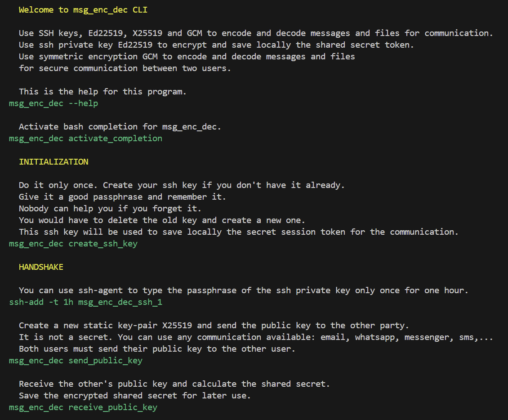

<!-- markdownlint-disable MD041 -->
[//]: # (auto_md_to_doc_comments segment start A)

# msg_enc_dec

[//]: # (auto_cargo_toml_to_md start)

**Use SSH keys, Ed22519, X25519 and GCM to encode and decode messages and files**  
***version: 0.0.60 date: 2025-10-14 author: [bestia.dev](https://bestia.dev) repository: [GitHub](https://github.com/bestia-dev/msg_enc_dec)***

 
 
 

[//]: # (auto_cargo_toml_to_md end)

 
 
 

[//]: # (auto_lines_of_code start)
[](https://github.com/bestia-dev-work-in-progress/msg_enc_dec/)
[](https://github.com/bestia-dev-work-in-progress/msg_enc_dec/)
[](https://github.com/bestia-dev-work-in-progress/msg_enc_dec/)
[](https://github.com/bestia-dev-work-in-progress/msg_enc_dec/)
[](https://github.com/bestia-dev-work-in-progress/msg_enc_dec/)

[//]: # (auto_lines_of_code end)

Hashtags: #maintained #work-in-progress #rustlang  
My projects on GitHub are more like a tutorial than a finished product: [bestia-dev tutorials](https://github.com/bestia-dev/tutorials_rust_wasm).  

## ⚠️ Security Warning

The implementation contained in this crate has never been independently audited!

USE AT YOUR OWN RISK!

## Try it

For encrypted communication between two parties, both must use msg_enc_dec.  
Install msg_enc_dec from GitHub.  
It is preferred to use Rust locally to build the program, so you know exactly the source code.

```bash
cd ~/rustprojects
git clone git@github.com:bestia-dev-work-in-progress/msg_enc_dec.git
code msg_enc_dec
cargo auto release
alias msg_enc_dec="./target/release/msg_enc_dec"
msg_enc_dec --help
```




## activate bash completion


## Create your SSH key

Create the SSH key and protect it with a passcode.

```bash
ssh-keygen -t rsa -b 2048 -f ~/.ssh/msg_enc_dec_ssh_1 -C "ssh key for msg_enc_dec"
```

Save the file `msg_enc_dec_config.json` with the content:

```json
{
"msg_enc_dec_private_key_file_name":"msg_enc_dec_ssh_1"
}
```

The program `msg_enc_dec` will read this file to find the SSH private key in the `~/.ssh` folder.

## 1. Party_1: Send your SSH public key

To start the secure communication send your public key. This is not a secret.

## 2. Party_2: Encrypt a password

The party_2 will encrypt an ephemeral password with the received public key. The only one who can decrypt this is the owner of the private key, so party_1.
Send this encrypted message to party_1.

## 3. Party_1: decrypt the


## Cryptography

Cryptography is a technique of securing information and communications using codes to ensure confidentiality, integrity and authentication.  
Modern ciphers, such as the Advanced Encryption Standard (AES), are considered virtually unbreakable.  
Secret key cryptography, also known as symmetric encryption, uses a single key to encrypt and decrypt a message.  
Public key cryptography (PKC), or asymmetric cryptography, uses mathematical functions to create codes that are exceptionally difficult to crack. It enables people to communicate securely over a non-secure communications channel without the need for a secret key.  
<https://www.fortinet.com/resources/cyberglossary/what-is-cryptography>

## OpenSSH

OpenSSH is the premier connectivity tool for remote login with the SSH protocol. It encrypts all traffic to eliminate eavesdropping, connection hijacking, and other attacks.  
Key management with ssh-add, ssh-keysign, ssh-keyscan, and ssh-keygen, ssh-agent.  
<https://www.openssh.com/>

Open SSH uses Ed22519 for authentication. The SSH servers has a list of public keys that are authorized. The handshake: The server sends a random message. The client signs it with the private key Ed25519. The SSH server verifies the signature with the public key Ed25519.

OpenSSH comes with tools to manage keys and it is a knowledge every developer learns early and thoroughly. The private key is protected by a passphrase. For repetitive use of the same private key I can use ssh-agent to input the passphrase only once. Usually the key inside ssh-agent is time limited for example for one hour.

## bestia.dev

I use Ed25519 to store encrypted values on the local disk. First I create random 32 bytes called the 'seed'. I sign it with the private key Ed25519. That becomes the password I use to symmetrically encrypt GCM the secret value. In the saved file there is in plain text the seed and the encrypted data. Only the owner of the private key Ed25519 can sign the seed to get the password to then decrypt GCM the data.

## Ed25519

Ed25519 is the EdDSA signature scheme using SHA-512 (SHA-2) and an elliptic curve related to Curve25519.  
In public-key cryptography, Edwards-curve Digital Signature Algorithm (EdDSA) is a digital signature scheme using a variant of Schnorr signature based on twisted Edwards curves. It is designed to be faster than existing digital signature schemes without sacrificing security.  
Public keys are 256 bits long and signatures are 512 bits long.  
<https://en.wikipedia.org/wiki/EdDSA#Ed25519>

Ed25519 is a signature scheme. It does not do encryption.  

## X25519

X25519 is the name given to the Elliptic Curve Diffie-Hellman (ECDH) key exchange built on Ed22519.  
<https://medium.com/@aditrizky052/unlocking-the-power-of-curve25519-ed25519-x25519-the-modern-pillars-of-secure-and-high-speed-a3daefbad0a4>

The Diffie-Hellman algorithm (DH) is used for secret key exchanges and requires two people to agree on a large prime number.  
Key Exchange Algorithm KEA is a variation of the Diffie-Hellman algorithm and was proposed as a method for key exchange.  
<https://www.fortinet.com/resources/cyberglossary/what-is-cryptography>

## GCM

In cryptography, Galois/Counter Mode (GCM) is a mode of operation for symmetric-key cryptographic block ciphers which is widely adopted for its performance. The GCM algorithm provides data authenticity, integrity and confidentiality and belongs to the class of authenticated encryption with associated data (AEAD) methods.  
<https://en.wikipedia.org/wiki/Galois/Counter_Mode>  

## Base64

In computer programming, Base64 is a group of binary-to-text encoding schemes that transforms binary data into a sequence of printable characters, limited to a set of 64 unique characters. More specifically, the source binary data is taken 6 bits at a time, then this group of 6 bits is mapped to one of 64 unique characters.  
The particular set of 64 characters chosen to represent the 64-digit values for the base varies between implementations. The general strategy is to choose 64 characters that are common to most encodings and that are also printable. For example, MIME's Base64 implementation uses A–Z, a–z, and 0–9 for the first 62 values. Other variations share this property but differ in the symbols chosen for the last two values.  
The base64url RFC 4648 §5 standard is URL and filename-safe, where the '+' and '/' characters are replaced by '-' and '_'.  
The = symbol is also used as a padding suffix. The padding character is not essential for decoding, since the number of missing bytes can be inferred from the length of the encoded text. In some implementations, the padding character is mandatory, while for others it is not used.
<https://en.wikipedia.org/wiki/Base64>


## Use SSH keys, Ed22519, X25519 and GCM to encode and decode messages and files

With one SSH private key, we can store many secret tokens.

```bash
msg_enc_dec list
msg_enc_dec store token_name
msg_enc_dec show token_name
msg_enc_dec delete token_name
```


## Development details

Read the development details in a separate md file:
[DEVELOPMENT.md](DEVELOPMENT.md)

## Releases changelog

Read the releases changelog in a separate md file:
[RELEASES.md](RELEASES.md)

## TODO

- better readme

## Open-source and free as a beer

My open-source projects are free as a beer (MIT license).  
I just love programming.  
But I need also to drink. If you find my projects and tutorials helpful, please buy me a beer by donating to my [PayPal](https://paypal.me/LucianoBestia).  
You know the price of a beer in your local bar ;-)  
So I can drink a free beer for your health :-)  
[Na zdravje!](https://translate.google.com/?hl=en&sl=sl&tl=en&text=Na%20zdravje&op=translate) [Alla salute!](https://dictionary.cambridge.org/dictionary/italian-english/alla-salute) [Prost!](https://dictionary.cambridge.org/dictionary/german-english/prost) [Nazdravlje!](https://matadornetwork.com/nights/how-to-say-cheers-in-50-languages/) 🍻

[//bestia.dev](https://bestia.dev)  
[//github.com/bestia-dev](https://github.com/bestia-dev)  
[//bestiadev.substack.com](https://bestiadev.substack.com)  
[//youtube.com/@bestia-dev-tutorials](https://youtube.com/@bestia-dev-tutorials)  

[//]: # (auto_md_to_doc_comments segment end A)
